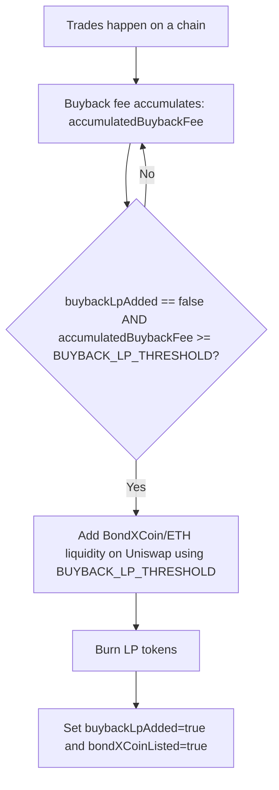
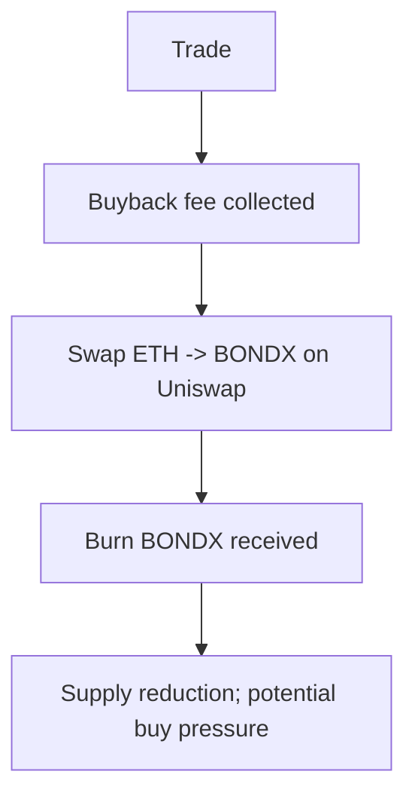

# Diagrams

These diagrams are intended to make the mechanics easy to visualize. They are conceptual and should match the deployed contract behavior.

## BondXCoin LP bootstrap (current design)



## Fee routing on buys/sells (high-level)

```mermaid
flowchart TD
  T[Trade (buy/sell)] --> F[Compute market-cap fee tier]
  F --> TR[Treasury fee]
  F --> CR[Creator fee]
  F --> BB[Buyback fee]
  TR --> TR2[Send to treasuryAddress + increment accumulator]
  CR --> CR2[Send to token creator]
  BB --> BB2[Accumulate; bootstrap LP once; then buyback+burn when thresholds are met]
```

## Buyback + burn (concept)



## BondXCoin LP bootstrap + LP burn (concept)

```mermaid
flowchart TD
  A[Buyback fee accumulation] --> B[When threshold reached, add liquidity (ETH + BondXCoin)]
  B --> C[Burn LP tokens]
  C --> D[BondXCoin liquidity can increase; buyback/burn can proceed later]
```


