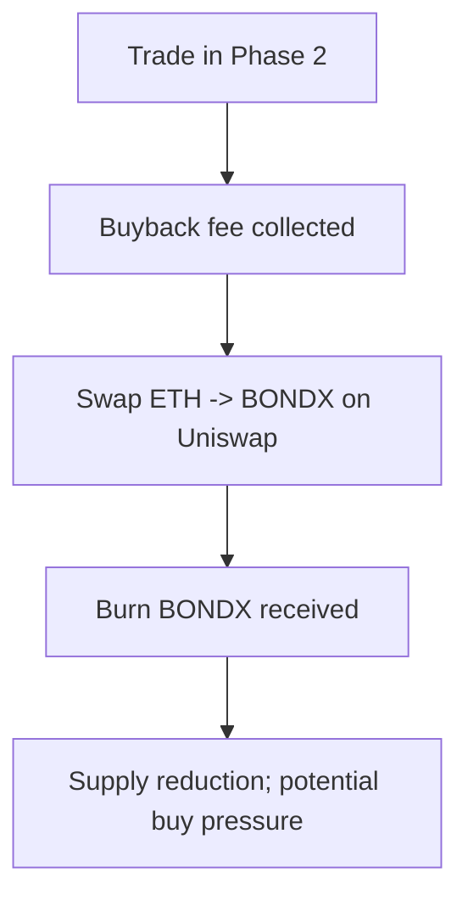

# Diagrams

These diagrams are intended to make the mechanics easy to visualize. They are conceptual and should match the deployed contract behavior.

## Phase 1 → Phase 2 activation (current design)

```mermaid
flowchart TD
  A[Trades happen on a chain] --> B[LP fee accumulates: accumulatedLPFee]
  B --> C{accumulatedLPFee >= LP_LISTING_THRESHOLD?}
  C -- No --> B
  C -- Yes --> D[Owner calls listBondXCoinManually()]
  D --> E[Add BONDX liquidity on Uniswap]
  E --> F[Burn LP tokens]
  F --> G[Set isPhase2Active = true]
```

## Fee routing on buys/sells (high-level)

```mermaid
flowchart TD
  T[Trade (buy/sell)] --> F[Compute phase-based fees]
  F --> TR[Treasury fee]
  F --> LP[LP fee]
  F --> BB[Buyback fee]
  TR --> TR2[Send to treasuryAddress + increment accumulator]
  LP --> LP2[Accumulate in Phase 1 / Execute ops in Phase 2]
  BB --> BB2[0% in Phase 1 / Execute buyback+burn in Phase 2]
```

## Phase 2 buyback + burn (concept)



## Phase 2 liquidity add + LP burn (concept)

```mermaid
flowchart TD
  A[Trade in Phase 2] --> B[LP fee collected]
  B --> C[Split ETH: half buys BONDX]
  C --> D[Add liquidity (ETH + BONDX)]
  D --> E[Burn LP tokens]
  E --> F[Liquidity depth can grow over time]
```


